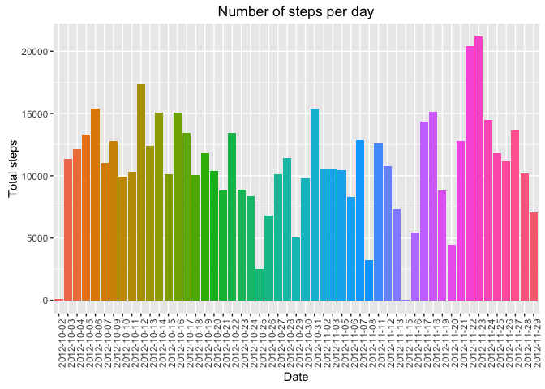
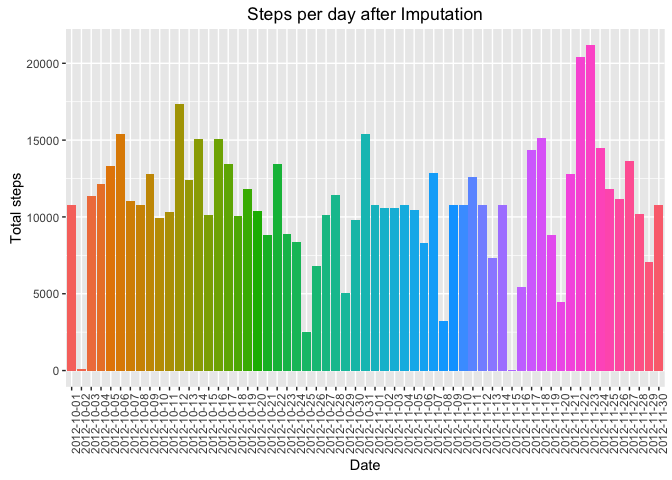
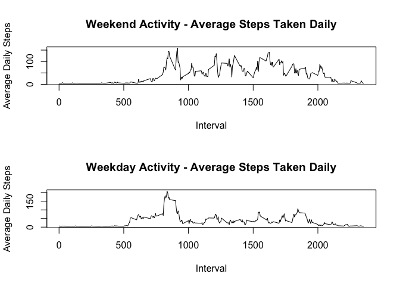

# Reproducible Research: Peer Assessment 1
Hilary Condon  
May 15, 2016  

So, to start, I'm going to lay out some global settings - 


```r
echo = TRUE #Always make code visible
options(scipen = 1) # No scientific notation of numbers, please
```


and load in some packages.

```r
library(ggplot2)
```

```
## Warning: package 'ggplot2' was built under R version 3.2.4
```

```r
library(scales)
library(Hmisc)
```

```
## Loading required package: lattice
```

```
## Loading required package: survival
```

```
## Loading required package: Formula
```

```
## 
## Attaching package: 'Hmisc'
```

```
## The following objects are masked from 'package:base':
## 
##     format.pval, round.POSIXt, trunc.POSIXt, units
```

```r
library(stats)
library(utils)
library(dplyr)
```

```
## 
## Attaching package: 'dplyr'
```

```
## The following objects are masked from 'package:Hmisc':
## 
##     combine, src, summarize
```

```
## The following objects are masked from 'package:stats':
## 
##     filter, lag
```

```
## The following objects are masked from 'package:base':
## 
##     intersect, setdiff, setequal, union
```

```r
library(xtable)
```

```
## 
## Attaching package: 'xtable'
```

```
## The following objects are masked from 'package:Hmisc':
## 
##     label, label<-
```

## Loading and preprocessing the data
First, I am going to check to see if a.) the data is already available and
then I am going to b.) read the data in as projectData. 


```r
#a.)
if(!file.exists("getdata-projectfiles-UCI HAR Dataset.zip")) {
        dataSet <- tempfile()
        download.file("http://d396qusza40orc.cloudfront.net/repdata%2Fdata%2Factivity.zip", dataSet)
        unzip(dataSet, overwrite= FALSE)
        unlink(dataSet)
}
```

```
## Warning in unzip(dataSet, overwrite = FALSE): not overwriting file './
## activity.csv
```

```r
#b.)
## Classes for the data: integer, Data, factor
classesForProj <- c("numeric","Date","numeric")
projectData <- read.csv("activity.csv", colClasses= classesForProj)
```


Let's take a quick look at the data - excluding missing values. 


```r
notMissingProjectData <- na.omit(projectData)
summary(notMissingProjectData)
```

```
##      steps             date               interval     
##  Min.   :  0.00   Min.   :2012-10-02   Min.   :   0.0  
##  1st Qu.:  0.00   1st Qu.:2012-10-16   1st Qu.: 588.8  
##  Median :  0.00   Median :2012-10-29   Median :1177.5  
##  Mean   : 37.38   Mean   :2012-10-30   Mean   :1177.5  
##  3rd Qu.: 12.00   3rd Qu.:2012-11-16   3rd Qu.:1766.2  
##  Max.   :806.00   Max.   :2012-11-29   Max.   :2355.0
```

What are the dimensions of the dataFrame?


```r
dim(notMissingProjectData)
```

```
## [1] 15264     3
```


## What is mean total number of steps taken per day?

```r
total_steps_per_day <- aggregate(steps ~ date, projectData, FUN = sum)

ggplot(total_steps_per_day, aes(x = factor(date), y = steps, fill = factor(date))) +
  geom_bar(stat = "identity") + theme(legend.position = "none",
    axis.text.x = element_text(angle = 90, hjust = 1)) + labs(x = "Date",
      y = "Total steps", title = "Number of steps per day")
```



### Mean and Median of the Total Daily Steps 


```r
steps_mean <- mean(total_steps_per_day$steps, na.rm = TRUE)
steps_median <- median(total_steps_per_day$steps, na.rm = TRUE)
```

The **mean** of the total steps per day is 10766.1886792 and the **median** is 10765.

## What is the average daily activity pattern?


```r
averages <- aggregate(x=list(steps=projectData$steps), by=list(interval=projectData$interval),
                      FUN=mean, na.rm=TRUE)
ggplot(data=averages, aes(x=interval, y=steps)) +
    geom_line() +
    xlab("5-minute interval") +
    ylab("average number of steps taken")
```


Which 5-minute interval contains the maximum number of steps?


```r
averages[which.max(averages$steps),]
```

```
##     interval    steps
## 104      835 206.1698
```

## Imputing missing values

### 1. Calculate and report the total number of missing values in the dataset. 


```r
#NAs per column
sapply(projectData, function(x) sum(is.na(x)))
```

```
##    steps     date interval 
##     2304        0        0
```

###2. Devise a strategy for filling in all of the missing values. 
Missing values are in steps column only. 
I will fill in missing values in the dataset with the mean for corresponding the 5 minute interval.


###3. Create a new dataset that is equal to the original but with the missing data filled in. 

```r
## Copy Original Data Set

imputedData <- projectData

imputedData$steps <- impute(projectData$steps, fun = mean)

## Compare Summaries of Both Data Sets
summary(projectData)
```

```
##      steps             date               interval     
##  Min.   :  0.00   Min.   :2012-10-01   Min.   :   0.0  
##  1st Qu.:  0.00   1st Qu.:2012-10-16   1st Qu.: 588.8  
##  Median :  0.00   Median :2012-10-31   Median :1177.5  
##  Mean   : 37.38   Mean   :2012-10-31   Mean   :1177.5  
##  3rd Qu.: 12.00   3rd Qu.:2012-11-15   3rd Qu.:1766.2  
##  Max.   :806.00   Max.   :2012-11-30   Max.   :2355.0  
##  NA's   :2304
```

```r
summary(imputedData)
```

```
## 
##  2304 values imputed to 37.3826
```

```
##      steps             date               interval     
##  Min.   :  0.00   Min.   :2012-10-01   Min.   :   0.0  
##  1st Qu.:  0.00   1st Qu.:2012-10-16   1st Qu.: 588.8  
##  Median :  0.00   Median :2012-10-31   Median :1177.5  
##  Mean   : 37.38   Mean   :2012-10-31   Mean   :1177.5  
##  3rd Qu.: 37.38   3rd Qu.:2012-11-15   3rd Qu.:1766.2  
##  Max.   :806.00   Max.   :2012-11-30   Max.   :2355.0
```

```r
## Compare Dimensions of Both Data Sets
dim(projectData)
```

```
## [1] 17568     3
```

```r
dim(imputedData)
```

```
## [1] 17568     3
```

###4. Make a histogram of the total number of steps taken each day

```r
impSteps_per_day <- aggregate(steps ~ date, imputedData, FUN = sum)

ggplot(impSteps_per_day, aes(x = factor(date), y = steps, fill = factor(date))) +
  geom_bar(stat = "identity") + theme(legend.position = "none",
    axis.text.x = element_text(angle = 90, hjust = 1)) + labs(x = "Date",
      y = "Total steps", title = "Steps per day after Imputation")
```




###5. Calculate and report the mean and median total number of steps taken per day. 

```r
steps_mean_imputed <- mean(impSteps_per_day$steps, na.rm = TRUE)
steps_median_imputed <- median(impSteps_per_day$steps, na.rm = TRUE)
```


Value         | FirstDataSet  | ImputedDataSet | Difference
------------- |------------- | -------------   | -------------
Mean          |  10766.1886792 | 10766.1886792 | 0
Median        | 10765 | 10766.1886792 | -1.1886792


## Are there differences in activity patterns between weekdays and weekends?

Create a factor variable in the dataset with two levels - "weekday" and "weekend"


```r
weekDayData <- imputedData
weekDayData$daytype <- as.factor(ifelse(weekdays(weekDayData$date)
  %in% c("Saturday", "Sunday"), "Weekend", "Weekday")) 

weekend <- subset(weekDayData, subset = weekDayData$daytype == "Weekend")
averageWeekendSteps <- aggregate(steps ~ interval, weekend, FUN = mean)
weekday <- subset(weekDayData, subset = weekDayData$daytype == "Weekday")
averageWeekdaySteps <- aggregate(steps ~ interval, weekday, FUN = mean)

weekdayMean <- mean(weekday$steps, na.rm = TRUE)


weekendMean <-mean(weekend$steps, na.rm = TRUE)

summary(weekend)
```

```
## 
##  576 values imputed to 37.3826
```

```
##      steps             date               interval         daytype    
##  Min.   :  0.00   Min.   :2012-10-06   Min.   :   0.0   Weekday:   0  
##  1st Qu.:  0.00   1st Qu.:2012-10-18   1st Qu.: 588.8   Weekend:4608  
##  Median :  0.00   Median :2012-10-31   Median :1177.5                 
##  Mean   : 42.37   Mean   :2012-10-31   Mean   :1177.5                 
##  3rd Qu.: 37.38   3rd Qu.:2012-11-12   3rd Qu.:1766.2                 
##  Max.   :785.00   Max.   :2012-11-25   Max.   :2355.0
```

```r
summary(weekday)
```

```
## 
##  1728 values imputed to 37.3826
```

```
##      steps             date               interval         daytype     
##  Min.   :  0.00   Min.   :2012-10-01   Min.   :   0.0   Weekday:12960  
##  1st Qu.:  0.00   1st Qu.:2012-10-16   1st Qu.: 588.8   Weekend:    0  
##  Median :  0.00   Median :2012-10-31   Median :1177.5                  
##  Mean   : 35.61   Mean   :2012-10-31   Mean   :1177.5                  
##  3rd Qu.: 37.38   3rd Qu.:2012-11-15   3rd Qu.:1766.2                  
##  Max.   :806.00   Max.   :2012-11-30   Max.   :2355.0
```
Value         | Weekday  | Weekend | Difference
------------- |------------- | -------------   | -------------
Mean          |  35.6105812 | 42.3664013 | -6.7558202


```r
par(mfrow = c(2, 1) )
plot(steps ~ interval, averageWeekendSteps, type = "l", main = "Weekend Activity - Average Steps Taken Daily",
  xlab = "Interval", ylab = "Average Daily Steps") 
plot(steps ~ interval, averageWeekdaySteps, type = "l", main = "Weekday Activity - Average Steps Taken Daily",
  xlab = "Interval", ylab = "Average Daily Steps")
```



More steps, on average, appear to be taken on Weekends. 
